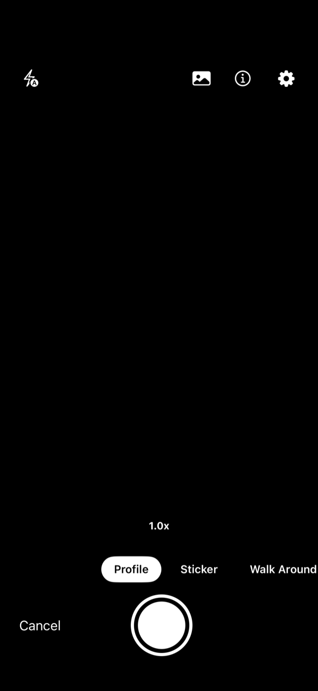
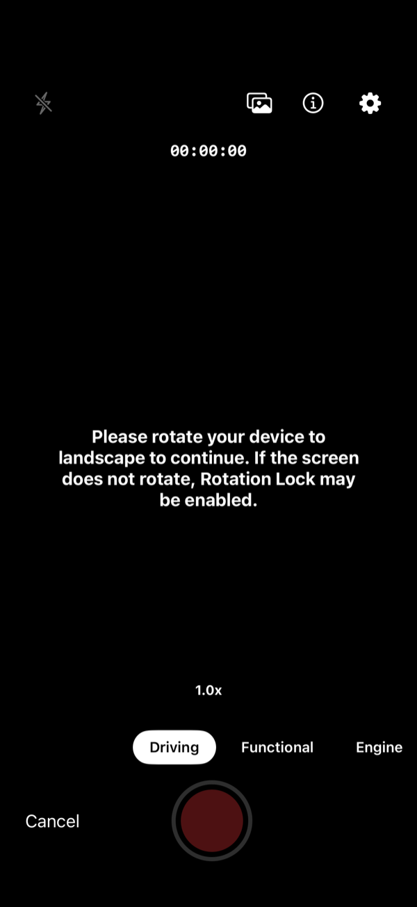
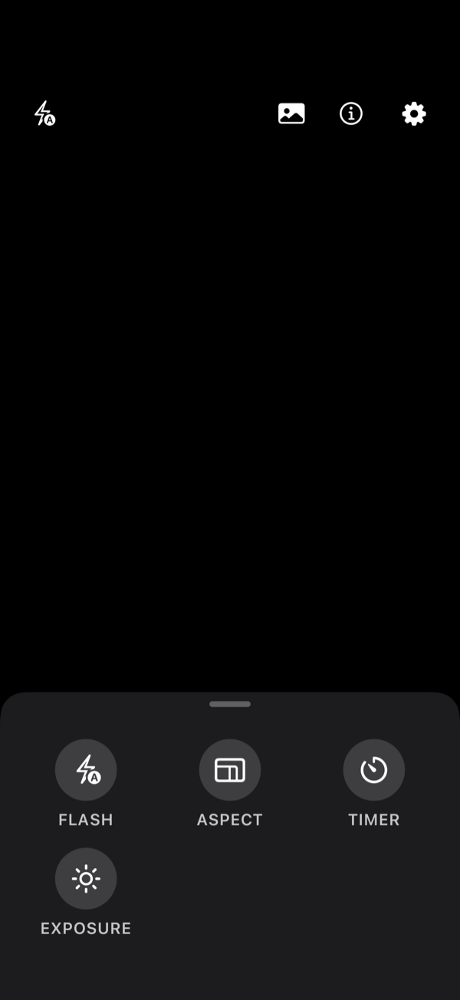
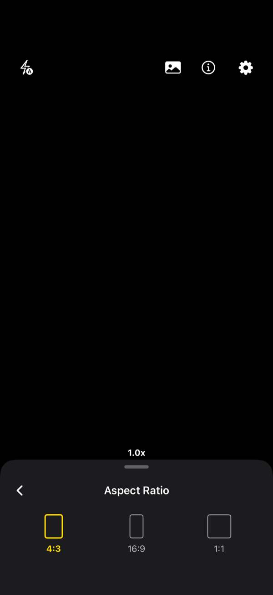
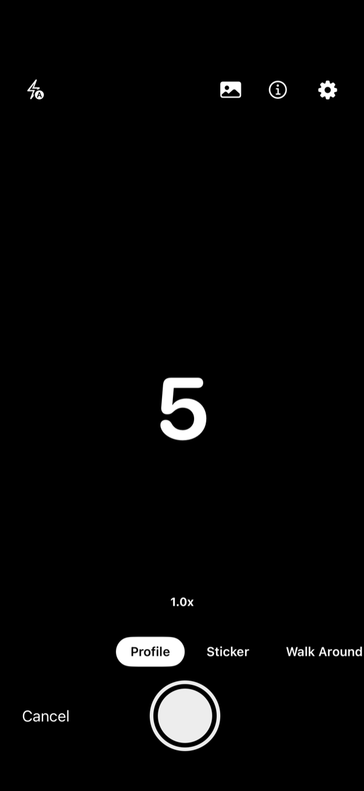
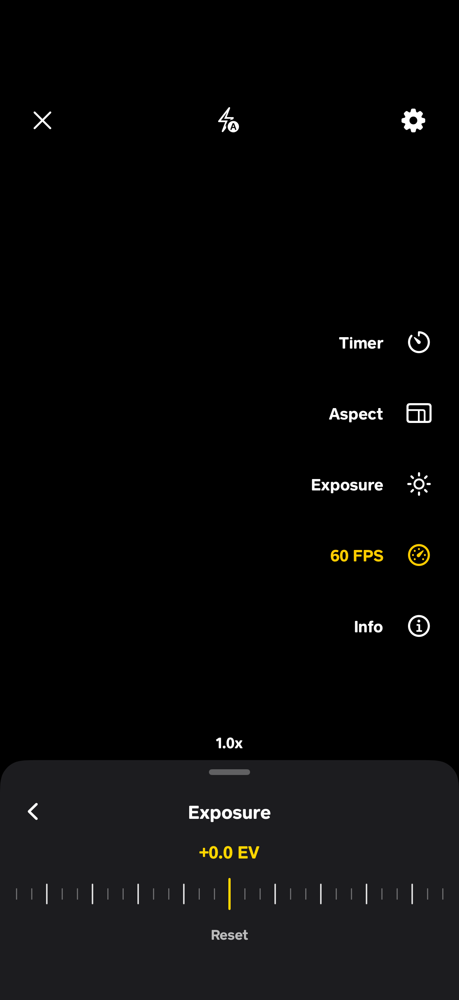
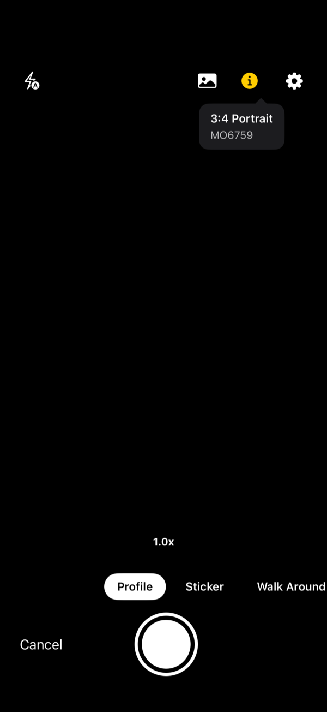
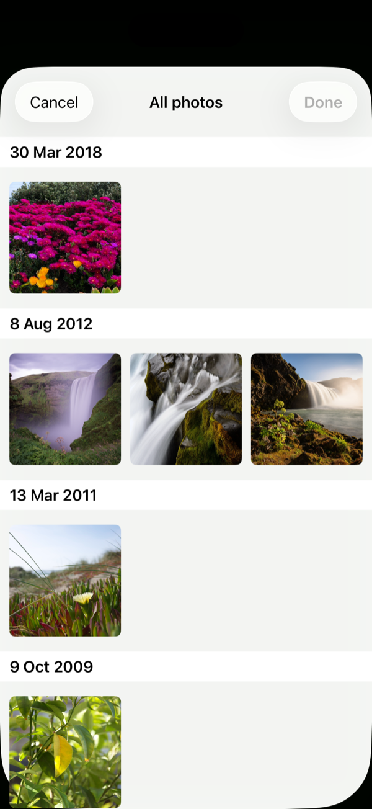
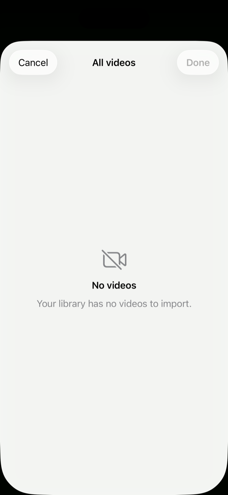

# Focal

A Swift Package that renders a **camera capture screen** and a **landscape video
recorder** for iOS. Built SwiftUI-first, with AVFoundation doing the capture
work. Self-contained and domain-agnostic, so it can be dropped into any app.

- **iOS 17+**, Swift 5.9.
- **Callback / delegate based** — the SDK captures media and hands it back; your
  app decides how to store or upload it. **Nothing is written to disk for you**:
  photos are handed over as bytes, and recordings as a file you take ownership
  of.
- **One dependency**, resolved by SwiftPM:
  [Transmission](https://github.com/nathantannar4/Transmission) (`2.16.x`) for
  the zoom transition on the full-screen photo preview.
- **Polished capture UI** — a rounded, edge-to-edge preview card; a right-edge
  tool rail (timer, aspect, exposure, FPS, lens, info); an on-screen **60 ⁄ 30
  fps** toggle; press-to-scale controls; and a bundled rounded display font.

---

## Screenshots

| Photo capture | Video recorder |
| :---: | :---: |
|  |  |

| Settings | Aspect ratio | Self-timer | Exposure |
| :---: | :---: | :---: | :---: |
|  |  |  |  |

| Info tip | Gallery import | Nothing to import |
| :---: | :---: | :---: |
|  |  |  |

> Taken in the Simulator, which has no camera, so the viewfinder is black —
> everything else is exactly what the SDK draws. The capture screens show the top
> bar (close · flash/torch · settings), the right-edge tool rail with the **60
> FPS** toggle highlighted, the centred shutter, and the gallery button in line
> with the category selector; the settings/aspect/timer sheets open from either
> the gear or a rail icon. Video now records in whatever orientation the device
> is held — set `landscapeOnly` to restrict it to landscape.

---

## Features

Both screens share the same capture feature set:

| Feature | Photo | Video |
| --- | :---: | :---: |
| Live preview | ✅ | ✅ |
| Pinch to zoom (1×–5×) | ✅ | ✅ |
| Tap to focus / expose | ✅ | ✅ |
| Flash (photo) / Torch (video) | ✅ | ✅ |
| Ultra-wide ↔ wide lens switch | ✅ | ✅ |
| Custom multi-select gallery import | ✅ | ✅ |
| Day-grouped picker with empty / denied states | ✅ | ✅ |
| Batch callback for a whole import | ✅ | ✅ |
| Consumer-defined category selector | ✅ (scroll) | ✅ (segmented) |
| Optional save-to-photo-library | ✅ | ✅ |
| Multi-capture (screen stays open) | ✅ | ✅ |
| Capture "drop into thumbnail" animation | ✅ | ✅ |
| Right-edge tool rail (timer, aspect, exposure, FPS, lens, info) | ✅ | ✅ |
| Settings sheet (flash/torch, aspect, timer, exposure, lens) | ✅ | ✅ |
| Capture frame rate — 60 / 30 fps, on-screen toggle | ✅ | ✅ |
| Aspect ratio — 4:3, 16:9, 1:1 | ✅ | ✅ |
| Self-timer — off, 3s, 5s, 10s | ✅ | ✅ |
| Manual exposure bias (device-reported range) | ✅ | ✅ |
| Optional capture location | ✅ | ✅ |
| Tap thumbnail → full-screen preview (zoom) | ✅ image | ✅ plays video |
| Optional landscape-only recording (`landscapeOnly`) | — | ✅ |
| Recording timer w/ optional auto-stop | — | ✅ |

> By default the recorder captures in **any orientation**. Set
> `landscapeOnly = true` to restrict it to landscape — in portrait it then shows
> a "rotate to landscape" overlay and disables the record button.

---

## On-screen layout

Both screens share one layout, built to feel like a system camera:

- **Preview card** — an edge-to-edge, rounded viewfinder filling the screen above
  a slim control bar.
- **Top bar** — close (`✕`), flash (photo) / torch (video), and settings.
- **Right tool rail** — a vertically-centred column of quick tools: **Lens**
  (device permitting), **Timer**, **Aspect**, **Exposure**, **FPS**, and
  **Info**. Timer/Aspect/Exposure jump straight to their pane in the settings
  sheet; FPS and Lens toggle in place; Info shows the aspect/badge tip. Backing
  out of a rail-opened pane dismisses the sheet rather than returning to the grid.
- **FPS toggle** — flips between **60** and **30** fps live; the starting value
  is `defaultFrameRate`.
- **Bottom bar** — the shutter / record button centred, the captured-media
  thumbnail trailing it, and the gallery button on the leading edge, in line with
  the category selector (which scrolls *under* it behind a soft fade).
- **Feel** — every control scales down while held and springs back on release
  (shutter `0.90`, icons and text `0.95`), and all on-screen text is set in a
  bundled rounded display font.

---

## Installation

### Swift Package Manager

In Xcode: **File ▸ Add Package Dependencies…** and point at this repository, or
add it to a `Package.swift`:

```swift
dependencies: [
    .package(url: "https://github.com/kwameaj67/Focal.git", from: "1.0.0")
],
targets: [
    .target(name: "YourApp", dependencies: [
        .product(name: "Focal", package: "Focal")
    ])
]
```

Depend on `FocalPhoto` instead of the umbrella if you only capture
stills — it links no microphone code, so the host needs no
`NSMicrophoneUsageDescription`.

`from: "1.0.0"` follows semantic versioning — it resolves to the latest `1.x`
(`>=1.0.0, <2.0.0`), picking up bug-fix and feature releases but not the next
major, which is where any breaking API change would land.

For local development you can also drag the `Focal` folder in as a
local package.

---

## Required Info.plist keys

A Swift package **cannot** declare privacy usage strings on your behalf — you
must add these to the **host app's** `Info.plist` or the app will crash when the
SDK requests access:

| Key | Needed for |
| --- | --- |
| `NSCameraUsageDescription` | Always (camera preview + capture) |
| `NSMicrophoneUsageDescription` | Video recording (audio) |
| `NSPhotoLibraryUsageDescription` | Gallery import |
| `NSPhotoLibraryAddUsageDescription` | `savesToPhotoLibrary = true` |
| `NSLocationWhenInUseUsageDescription` | `capturesLocation = true` |

Example:

```xml
<key>NSCameraUsageDescription</key>
<string>Used to capture photos and videos.</string>
<key>NSMicrophoneUsageDescription</key>
<string>Used to record audio with your videos.</string>
<key>NSPhotoLibraryUsageDescription</key>
<string>Used to import photos and videos from your library.</string>
<key>NSPhotoLibraryAddUsageDescription</key>
<string>Used to save captured media to your photo library.</string>
```

Permissions are requested at the moment they are needed, not all at once on
launch: the camera when a screen opens, the library when the user taps the
gallery button, add-only access when a capture is actually saved, and location
only if you set `capturesLocation`. Declining the library therefore leaves the
camera working. Only a denied **camera** blocks the screen, which shows an
"Open Settings" prompt.

---

## Quick start

### SwiftUI

```swift
import SwiftUI
import Focal

struct CaptureExample: View {
    @State private var showCamera = false

    var body: some View {
        Button("Take photos") { showCamera = true }
            .fullScreenCover(isPresented: $showCamera) {
                FCCameraScreen(
                    config: FCCameraConfig(
                        categories: [
                            FCCategory(id: "AMKT", title: "Profile"),
                            FCCategory(id: "STICKER", title: "Sticker"),
                            FCCategory(id: "WALK", title: "Walk Around")
                        ],
                        startingCategoryID: "AMKT",
                        overlayLabel: "MO6759"
                    ),
                    handlers: FCPhotoHandlers(
                        onCapture: { result in
                            // result.imageData, result.image, result.category …
                            print("Captured a \(result.category?.title ?? "photo")")
                        },
                        onImport: { results in
                            // Fires once per gallery selection, with the whole set.
                            print("Imported \(results.count) photos")
                        },
                        onFinish: { _ in showCamera = false }
                    )
                )
            }
    }
}
```

### UIKit

```swift
import UIKit
import Focal

final class MyViewController: UIViewController {
    func openCamera() {
        let vc = FCCamera.makePhotoCapture(
            config: FCCameraConfig(categories: [FCCategory("Profile")]),
            handlers: FCPhotoHandlers(
                onCapture: { result in /* store result */ },
                onFinish:  { _ in /* controller dismisses itself */ }
            )
        )
        present(vc, animated: true)
    }
}
```

A delegate-based overload is also available:

```swift
let vc = FCCamera.makePhotoCapture(config: config, delegate: self)
// self: FCPhotoCaptureDelegate  (held weakly)
```

### Video

```swift
FCVideoScreen(
    config: FCVideoConfig(
        categories: [
            FCCategory("Driving"),
            FCCategory("Functional"),
            FCCategory("Engine")
        ],
        maxDuration: 180,                       // auto-stop after 3 minutes
        landscapeOnly: true,                    // portrait shows a "rotate" prompt
        defaultFrameRate: .fps60,               // user can toggle 60 ⁄ 30 on screen
        presetByCategoryID: ["Driving": .hd1080],
        defaultPreset: .hd720
    ),
    handlers: FCVideoHandlers(
        onRecord: { result in
            // result.fileURL is a local .mov you now own — move or upload it
        },
        onImport: { results in
            // Fires once per gallery selection, with the whole set.
        },
        onFinish: { _ in /* dismiss */ }
    )
)
```

UIKit: `FCCamera.makeVideoRecorder(config:handlers:)` /
`makeVideoRecorder(config:delegate:)`.

---

## Configuration reference

### `FCCameraConfig` (photo)

| Property | Default | Description |
| --- | --- | --- |
| `categories` | `[]` | Pills in the category scroll bar. Empty hides it. |
| `startingCategoryID` | `nil` | Selected category on launch (falls back to first). |
| `defaultFlashMode` | `.auto` | `.auto` / `.on` / `.off`. |
| `defaultFrameRate` | `.fps60` | Starting capture frame rate; the user can toggle 60 ⁄ 30 fps from the rail. Falls back to the highest the device/format supports. |
| `allowsGallery` | `true` | Show the library-import button. |
| `allowsUltraWide` | `true` | Show the ultra-wide toggle (device permitting). |
| `savesToPhotoLibrary` | `false` | Also save captures to the `Focal` album. |
| `capturesLocation` | `false` | Attach a location fix to each result. Needs `NSLocationWhenInUseUsageDescription`. |
| `overlayLabel` | `nil` | Badge text shown in the info tip (e.g. an item ID). |
| `outputDirectory` | `nil` | Unused by the photo screen — it writes no files. Present for symmetry with the video config. |

### `FCVideoConfig` (video)

| Property | Default | Description |
| --- | --- | --- |
| `categories` | `[]` | Segments in the category control. |
| `landscapeOnly` | `false` | Restrict recording to landscape. When `true`, portrait shows a "rotate to landscape" overlay and disables the record button. |
| `startingCategoryID` | `nil` | Selected category on launch. |
| `maxDuration` | `nil` | Auto-stop length in seconds; `nil` = unlimited. |
| `presetByCategoryID` | `[:]` | Per-category capture quality. |
| `defaultPreset` | `.hd1080` | Quality for unlisted categories. |
| `defaultFrameRate` | `.fps60` | Starting capture frame rate; the user can toggle 60 ⁄ 30 fps from the rail. Falls back to the highest the device/format supports. |
| `allowsTorch` | `true` | Show the torch button. |
| `allowsUltraWide` | `true` | Show the ultra-wide toggle. |
| `allowsGallery` | `true` | Show the library-import button. |
| `savesToPhotoLibrary` | `false` | Also save recordings to the `Focal` album. |
| `capturesLocation` | `false` | Attach a location fix to each result. Needs `NSLocationWhenInUseUsageDescription`. |
| `maxFileSizeMB` | `400` | Reject imported videos larger than this. |
| `overlayLabel` | `nil` | Badge text shown in the info tip. |
| `outputDirectory` | `nil` | Where recordings are written; temp dir if `nil`. |

---

## Results

### Callbacks

| Closure | Delegate method | When it fires |
| --- | --- | --- |
| `onCapture` | `photoCapture(didCapture:)` | Once per photo, captured or imported. |
| `onRecord` | `videoRecorder(didRecord:)` | Once per video, recorded or imported. |
| `onImport` | `photoCapture(didImport:)` / `videoRecorder(didImport:)` | Once per gallery selection, with the whole set. |
| `onFinish` | `…(didFinish:)` | The user left via Done or Cancel. |
| `onError` | `…(didFail:)` | A recoverable failure — one bad capture or one unreadable asset. |

Every callback except `onCapture` / `onRecord` is optional: the handler structs
default them to no-ops, and the delegate protocols supply default
implementations.

### `didImport` / `onImport`

The per-item callback fires as each asset lands, so a host that wants to stream
uploads needs nothing else. `didImport` is **in addition** to that, for hosts
that want to act on the selection as a set — uploading a batch together, or
showing one "12 photos added" confirmation instead of twelve.

```swift
FCPhotoHandlers(
    onCapture: { result in
        // Fires 12 times for a 12-photo selection, one at a time.
        stage(result)
    },
    onImport: { results in
        // Then once more, with all 12.
        upload(batch: results)
    }
)
```

```swift
extension MyViewController: FCPhotoCaptureDelegate {
    func photoCapture(didCapture result: FCPhotoResult) { stage(result) }
    func photoCapture(didImport results: [FCPhotoResult]) { upload(batch: results) }
}
```

Two things to know:

- **Only successful imports appear.** An asset that fails to load is reported
  through `onError` and left out, so `results.count` can be smaller than the
  number of assets the user picked. Count it if that matters to you.
- **It does not fire for live captures**, and it does not fire at all when a
  selection produced nothing.

### `FCPhotoResult`
- `imageData: Data` — encoded (HEVC/JPEG) bytes.
- `image: UIImage` — decoded from `imageData` on first access, then held. See
  [Memory](#memory) below.
- `category: FCCategory?` — selected category (if any).
- `source: .camera | .gallery`
- `orientation: UIDeviceOrientation` — device orientation at capture.
- `metadata: [String: Any]?` — capture metadata when available.
- `location: CLLocation?` — a fix when `capturesLocation` is on and one was
  available. Always `nil` for gallery imports: where the phone is now says
  nothing about where the asset was taken.
- `capturedAt: Date` — for an import, the time of import rather than the
  asset's original creation date.

### `FCVideoResult`
- `fileURL: URL` — local `.mov` file; **ownership transfers to you** (move or
  delete it — the SDK writes to a temp directory by default).
- `category: FCCategory?`
- `duration: TimeInterval`
- `thumbnail: UIImage?` — at most 400×400.
- `source: .camera | .gallery`
- `location: CLLocation?`
- `capturedAt: Date`

### Memory

A decoded 12MP frame costs about **47 MB**; the same photo encoded is 1–2 MB.
Holding decoded images is therefore the one thing that will reliably get a
capture session killed by the system, so the SDK keeps as few resident as it
can — never one per photo taken:

- The on-screen pile and grid keep a small thumbnail and the encoded bytes. The
  full-screen preview decodes the page you are looking at and its immediate
  neighbours, and releases the rest as you swipe.
- `FCPhotoResult.image` decodes on first access and caches from then on, so a
  batch import hands you encoded bytes and nothing more until you ask for
  pixels. Reading `image` repeatedly — inside a SwiftUI `body`, say — costs
  nothing after the first read.

The practical consequence for a host: if you are processing a large import,
work through `imageData` and let each result go, rather than touching `image`
on all of them and holding the array.

---

## Permissions API

If you'd rather gate access yourself before presenting a screen:

```swift
let denied = await MediaPermissions.ensureVideoPermissions()
if denied == nil {
    // present FCVideoScreen
} else {
    MediaPermissions.openSettings()
}
```

`ensurePhotoPermissions()` covers the camera and `ensureVideoPermissions()` the
camera and microphone. Neither asks for the photo library — that is requested
when the user opens the gallery, and add-only access when a capture is saved,
so declining the library no longer takes down a working camera.

| Function | Target |
| --- | --- |
| `cameraStatus()` / `requestCamera()` | Camera |
| `microphoneStatus()` / `requestMicrophone()` | Microphone (`FocalVideo` only) |
| `photoLibraryStatus()` / `requestPhotoLibrary()` | Library read |
| `requestPhotoLibraryAdd()` | Library add-only |
| `ensurePhotoPermissions()` | Camera |
| `ensureVideoPermissions()` | Camera + microphone |
| `openSettings()` | Opens the host app's Settings page |

---

## Architecture

Four targets. Three do the work; the fourth is an umbrella that re-exports them
so `import Focal` gives you everything, as it always did.

```
FocalCore ──┬── FocalPhoto ──┐
                │                    ├── Focal (umbrella)
                └── FocalVideo ──┘
```

```
Sources/
├─ FocalCore/     everything both capture modes share
│  ├─ Engine/       CameraSessionController (session, device, queue, zoom,
│  │                focus, lens swap), the preview UIViewRepresentable,
│  │                orientation monitor, haptics, photo-library saving
│  ├─ Gallery/      SwiftUI multi-select PHAsset picker + import helpers
│  ├─ Permissions/  Camera / photo-library helpers (no microphone)
│  ├─ Public/       FCCategory, shared result values, the FCCamera namespace
│  └─ UI/           Category bar, drop animation, shared badges/overlays
├─ FocalPhoto/    stills: photo output, flash, FCCameraScreen
├─ FocalVideo/    recording: movie output, microphone, torch,
│                            presets, FCVideoScreen
└─ Focal/         umbrella; re-exports the three above
```

### Which target to depend on

| Depend on | You get | Microphone |
| --- | --- | --- |
| `Focal` | Everything (photo + video) | Required |
| `FocalPhoto` | Stills only | **Not needed** |
| `FocalVideo` | Recording only | Required |
| `FocalCore` | Session plumbing, no screens | Not needed |

The microphone column is the reason the package is split. Every
`AVCaptureDevice` audio call — querying authorization, requesting it, and
attaching the input — lives in `FocalVideo`. A host that depends only
on `FocalPhoto` links none of it, so it needs no
`NSMicrophoneUsageDescription` and discloses no microphone access in App Store
privacy details. (Requesting microphone access without that Info.plist key
crashes the app, so this is a correctness boundary, not just tidiness.)

Splitting did not widen the public API. Types that cross a target boundary but
aren't meant for hosts — `CameraSessionController`, the shared views, the
gallery — use Swift 5.9's `package` access level, so they're visible inside the
package and invisible outside it. The split itself added nothing to the public
surface; everything public since then came from a feature, not the refactor.

Design notes:

- **Engines are plain `ObservableObject`s**, not view controllers, so SwiftUI
  owns them as `@StateObject`. All `AVCaptureSession` mutation happens on a
  dedicated serial queue; all published state updates on the main actor.
- **Preview** uses a `UIView` whose backing layer *is* an
  `AVCaptureVideoPreviewLayer` (via `layerClass`), so it resizes for free.
- **Orientation** is read from the accelerometer (CoreMotion), not
  `UIDevice.orientation`, so overlays and capture orientation follow how the
  phone is physically held even if the app's UI is orientation-locked.
- **Categories are domain-agnostic**: the SDK never interprets a category, it
  just returns the selected one on every result.

### What was intentionally left out

This SDK is purely camera and video capture. It does **not** include any
application business logic: persistence, upload queues, telemetry, CDN wiring,
analytics, or barcode scanning. Those remain the host app's responsibility —
feed the `FCPhotoResult` / `FCVideoResult` into your own pipeline.

---

## License

Distributed under the BSD 2-Clause License. See LICENSE.md for more information.
